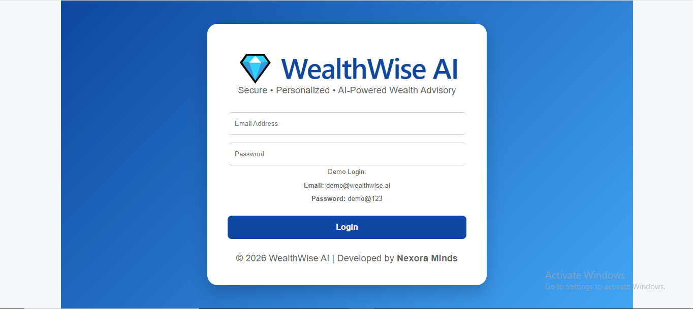
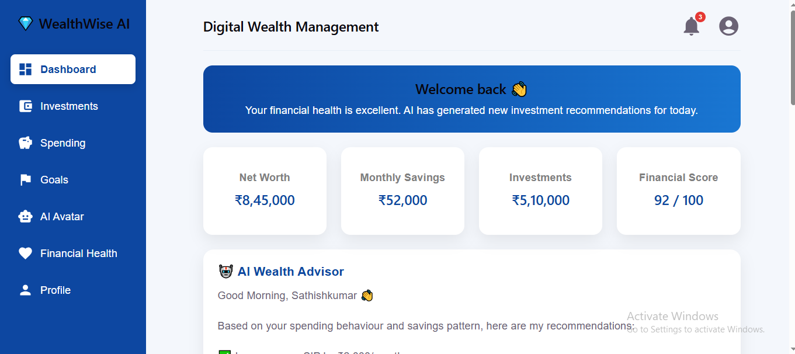
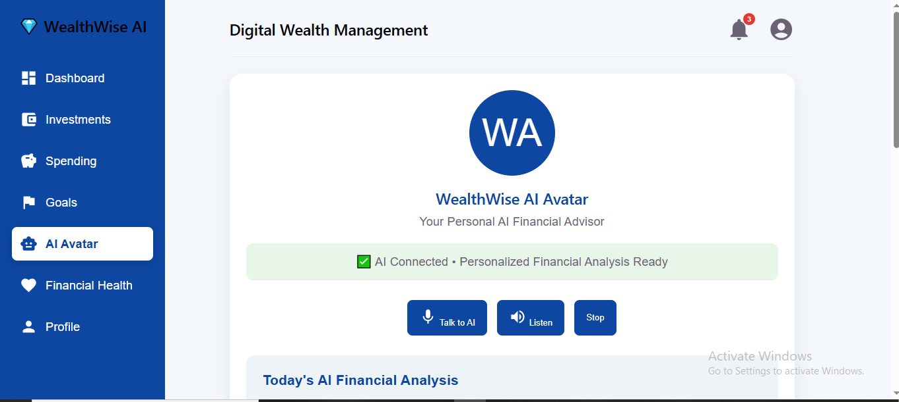
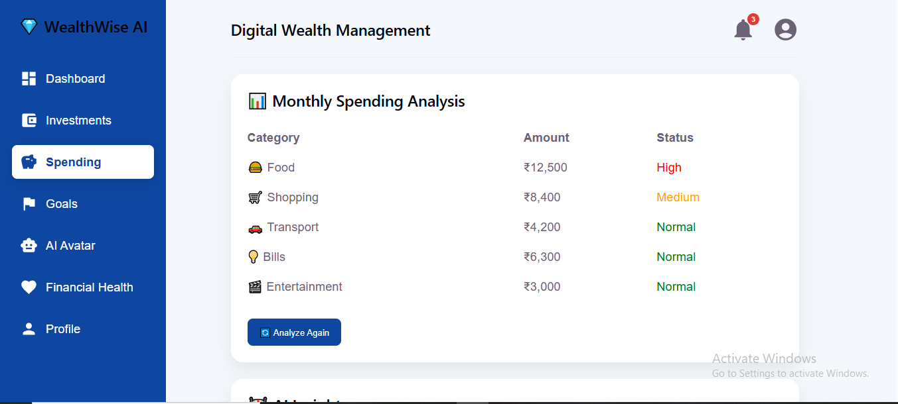
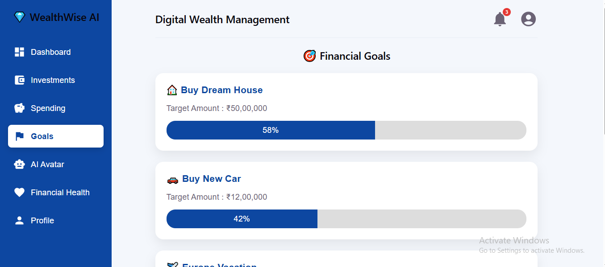
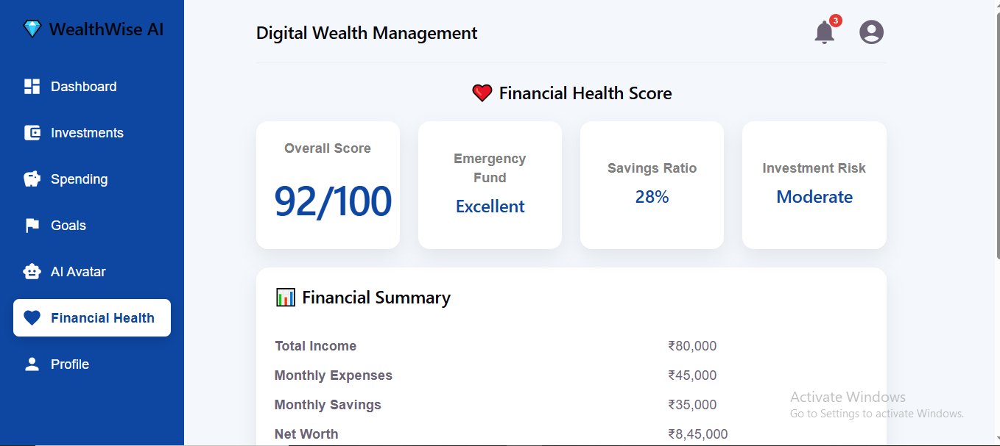
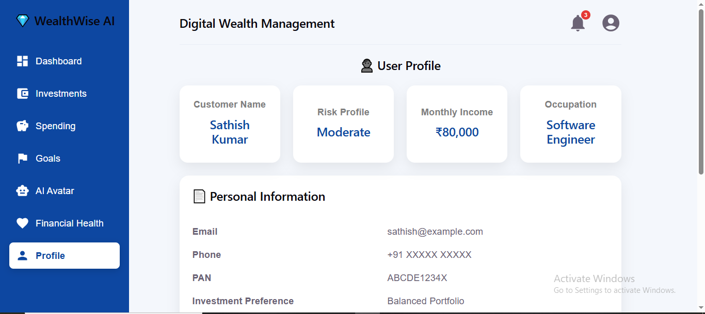

# 💎 WealthWise AI

> AI-Powered Digital Wealth Management Platform

WealthWise AI is an AI-powered Digital Wealth Management prototype developed for **IDBI Innovate Hackathon 2026** under **Problem Statement 1 – Digital Wealth Management**.

The application provides customers with personalized financial insights, investment recommendations, spending analysis, financial health monitoring, and an AI Avatar to simplify wealth management.

---

# 📌 Problem Statement

Traditional wealth management services are fragmented and often inaccessible to many customers. Banks require an intelligent digital platform that provides personalized financial guidance based on customer spending habits, investment behavior, and financial goals.

---

# 💡 Solution

WealthWise AI integrates AI-driven financial analysis with an interactive dashboard and AI Avatar to deliver:

- Personalized investment recommendations
- Spending analysis
- Financial health score
- Goal tracking
- Portfolio insights
- AI-powered financial advisory

---

# ✨ Features

- 🔐 Secure Login
- 📊 AI Wealth Dashboard
- 🤖 AI Avatar Assistant
- 💰 Investment Recommendations
- 📈 Portfolio Allocation
- 💳 Spending Analysis
- ❤️ Financial Health Score
- 🎯 Goal Tracking
- 💬 AI Financial Chat
- 📉 Monthly Savings Analytics
- 👤 User Profile
- 🔔 Notifications
- 📱 Responsive Design

---

# 🛠️ Tech Stack

### Frontend

- React.js
- Vite
- React Router

### UI

- CSS3
- Material UI Icons
- React Avatar

### Charts

- Recharts

### Browser APIs

- Web Speech API

### Deployment

- Netlify

### Version Control

- GitHub

---

# 📂 Project Structure

```
src
│
├── components
│   ├── Navbar.jsx
│   ├── Sidebar.jsx
│   ├── ChatBox.jsx
│   └── StatCard.jsx
│
├── pages
│   ├── Dashboard.jsx
│   ├── Avatar.jsx
│   ├── Investment.jsx
│   ├── Spending.jsx
│   ├── Goals.jsx
│   ├── FinancialHealth.jsx
│   ├── Profile.jsx
│   └── Login.jsx
│
├── styles
│
├── App.jsx
└── main.jsx
```

---

# 🚀 Installation

Clone the repository

```bash
git clone [https://github.com/rsathishkumar-2697/WealthWise-AI](https://github.com/rsathishkumar-2697/WealthWise-AI)
```

Navigate into the project

```bash
cd WealthWise-AI
```

Install dependencies

```bash
npm install
```

Start the development server

```bash
npm run dev
```

Build for production

```bash
npm run build
```

---

# 📸 Screenshots

## Login



---

## Dashboard



---

## AI Avatar



---

## Investment


---

## Spending



---

## Goals



---

## Financial Health



---

## Profile



---

# 🌐 Live Demo

https://nexoraminds-wealthwise-ai.netlify.app/

---

# 🔮 Future Enhancements

- Banking API Integration
- AI-based Investment Prediction
- Live Transaction Analysis
- Voice Assistant
- Secure Authentication
- PDF Wealth Reports
- Mutual Fund Recommendation Engine
- Multi-language Support
- Mobile Banking Integration

---

# 👨‍💻 Developed By

**Sathishkumar R**

**Team:** Nexora Minds

IDBI Innovate Hackathon 2026

---

# 📄 License

This project is developed for educational and hackathon purposes.
